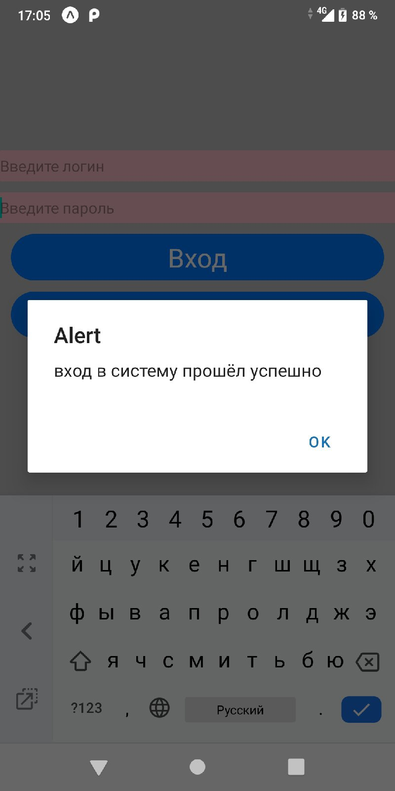

# apiworks
Тренировочный проект для связи с сервером. Необходим для того чтобы научиться принимать и взовращать данные с серивера в мбольное приложение.
## Что необходимо для работы
- Node.js + React Native 
- Expo CLI
- подключение телефона к компьютеру (по LAN, локально через USB провод, или с помощью туннелирования)
- Серверное приложение
## Запуск и руководство пользователя
- Необходимо войти через коносль в папку с приложением и запустить Metro Bundler с помощью команды **expo start**

- следом в браузере по умолчанию откроется Metro Bundler, с помощью которого можно курировать деятельность приложения. А именно запустить его на андроиде нажатием по кнопке **Run on Android device/emulator** (*в моём случае с использованием local подключения*)

- Далее приложение автоматически откроется на вашем устрйостве

- Функционал заключается в регистрации и входе, для проверки создадим аккаунт с логином *Тест* и паролем *тест*

- Пройдём регистрацию и сразу же проверим в СУБД

- Пройдём авторизацию и получим *acces token* в качестве подтвержедния того что вход выполнен

